<a name="readme-top"></a>

<div align="center">


<h1 align="center">Lobe Theme Redux</h1>

A continuation of [Lobe Theme](https://github.com/lobehub/sd-webui-lobe-theme) by LobeHub for Stable Diffusion WebUI Forge, Forge Classic (Neo) and reForge<br/>with an exquisite interface design, a highly customizable UI, and efficiency-boosting features.

English · [简体中文](./README.zh-CN.md) · [Changelog](./CHANGELOG.md) · [Report Bug][github-issues-link] · [Request Feature][github-issues-link]

<!-- SHIELD GROUP -->

[![][github-release-shield]][github-release-link]
[![][discord-shield]][discord-link]
[![][github-releasedate-shield]][github-releasedate-link]
[![][github-action-test-shield]][github-action-test-link]
[![][github-action-release-shield]][github-action-release-link]<br/>
[![][github-contributors-shield]][github-contributors-link]
[![][github-forks-shield]][github-forks-link]
[![][github-stars-shield]][github-stars-link]
[![][github-issues-shield]][github-issues-link]
[![][github-license-shield]][github-license-link]<br>
[![][sponsor-shield]][sponsor-link]

</div>

> \[!NOTE]
>
> Redux runs on Stable Diffusion WebUI Forge and Forge Classic (Neo), both on Gradio 4, and on reForge (Gradio 3.41). Plain AUTOMATIC1111 is not tested.

<div align="center">

<picture>
  <source media="(prefers-color-scheme: light)" srcset="./docs/redux/hero-light.webp">
  
</picture>

</div>

## 🔥 What's New in Redux

The original Lobe Theme was made for AUTOMATIC1111 on Gradio 3. **Redux brings it back to life for the Forge family**: rebuilt for Gradio 4 on Forge and Neo, still at home on reForge's Gradio 3.41, and grown with the tools you reach for every day. Everything below is new in Redux; the original README follows further down.

> \[!NOTE]
>
> The images in these screenshots come from a random-weight test model, so they are colour noise. Everything around them is the real theme.

<details>
<summary><kbd>What's new, at a glance</kbd></summary>

- [Runs on all three Forges](#runs-on-all-three-forges)
- [Aspect ratios and suggested settings](#aspect-ratios-and-suggested-settings)
- [Prompt sections](#prompt-sections)
- [A tab bar that stays short](#a-tab-bar-that-stays-short)
- [Extra Network, redesigned](#extra-network-redesigned)
- [Quick Setting sidebar](#quick-setting-sidebar)
- [Progress you can watch](#progress-you-can-watch)
- [Appearance: make it yours](#appearance-make-it-yours)
- [Command palette](#command-palette)
- [Generation history](#generation-history)
- [Presets](#presets)
- [And the small things](#and-the-small-things)

</details>

### Runs on all three Forges

| Forge Classic (Neo) · Gradio 4 | Forge · Gradio 4 | reForge · Gradio 3.41 |
| :-: | :-: | :-: |
| 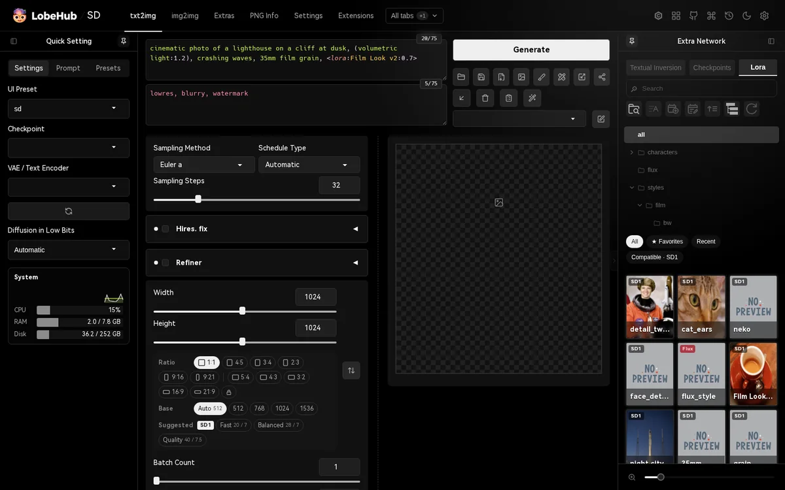 | 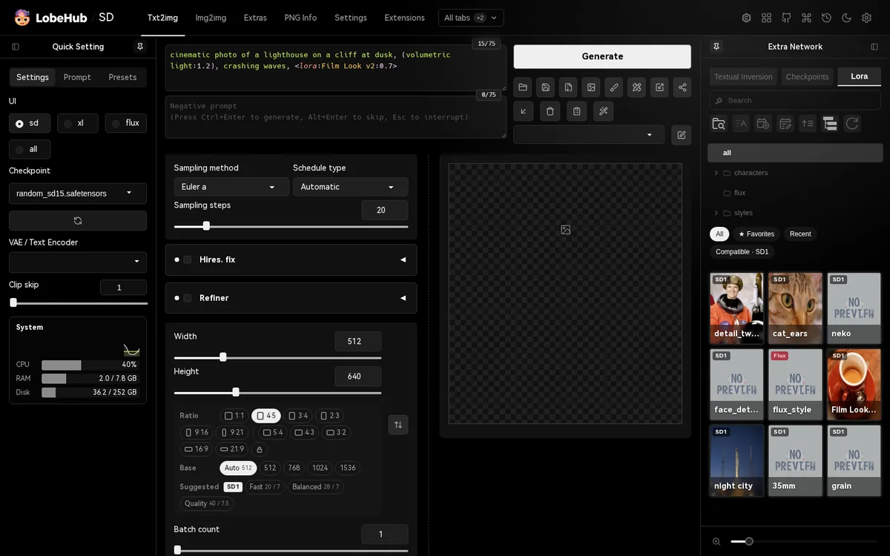 | 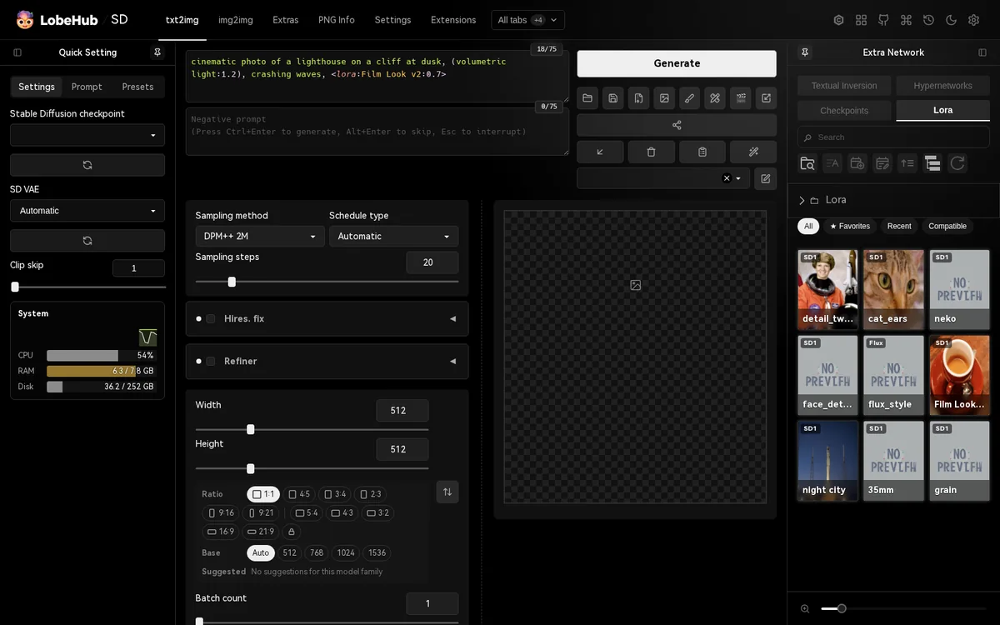 |

One extension, the same theme on each. Redux follows what each WebUI has: Neo's and Forge's **UI Preset** (sd, xl, flux...), Neo's model families, Flux's **Distilled CFG Scale**, reForge's folder tree view.

### Aspect ratios and suggested settings

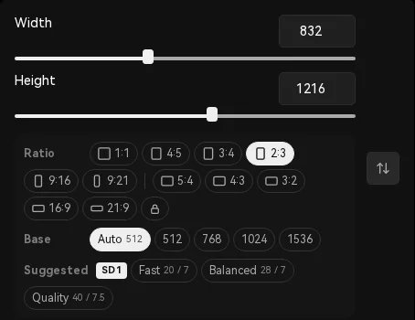

Under **Width** and **Height**:

- **Ratio**: 1:1 to 21:9 in one click, at the sizes models were trained on (832 × 1216 for 2:3 at 1024). The shape the sliders are at lights up.
- 🔒 keeps the shape while you move a slider.
- **Base**: how many pixels, from **Auto** (follows the loaded model) to 1536.
- **Suggested**: steps and CFG for the loaded model's family, including Lightning, Turbo, LCM, Hyper, DMD2 and Schnell checkpoints.

<br clear="right"/>

### Prompt sections

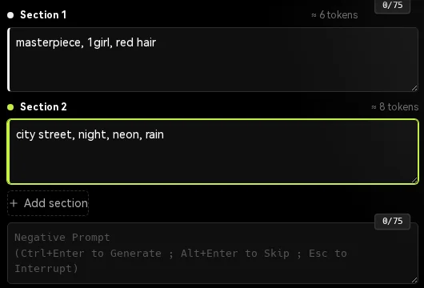

The ▤ button under the prompt splits the positive prompt into **sections**, one box each, instead of one long box with `BREAK` typed by hand. Each section is its own 75-token chunk, so a concept at the end no longer drifts away from the start.

- **＋ Add section** (up to six); ✕ removes one and moves its text to the section before.
- Each section shows about how many tokens it holds, highlighted past 75.
- The prompt that is generated is still the usual one: the sections joined with `BREAK`, so the infotext, PNG Info, styles and every extension see it as always.
- A prompt pasted, sent from PNG Info or set by an extension is split at its `BREAK`s; typing `BREAK` in a section splits it there.
- Press ▤ again to go back to one box, with `BREAK` where the sections met.
- <kbd>Ctrl</kbd>+<kbd>↑</kbd> / <kbd>↓</kbd> weights and <kbd>Ctrl</kbd>+<kbd>Enter</kbd> work in the sections.

This is not regional prompting: the whole image still gets the whole prompt.

<br clear="right"/>

### A tab bar that stays short

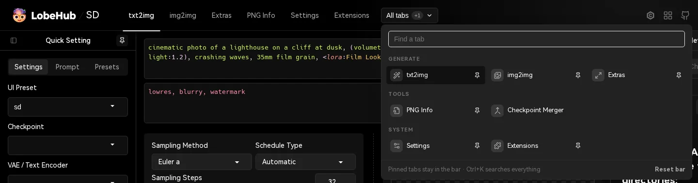

With many extensions installed, the header used to fill up with tabs. Now it holds only the tabs you pin; **All tabs** opens the rest, grouped into Generate, Tools, Extensions and System, with a search box. The bar is saved on the WebUI server, so every browser shows the same one.

### Extra Network, redesigned

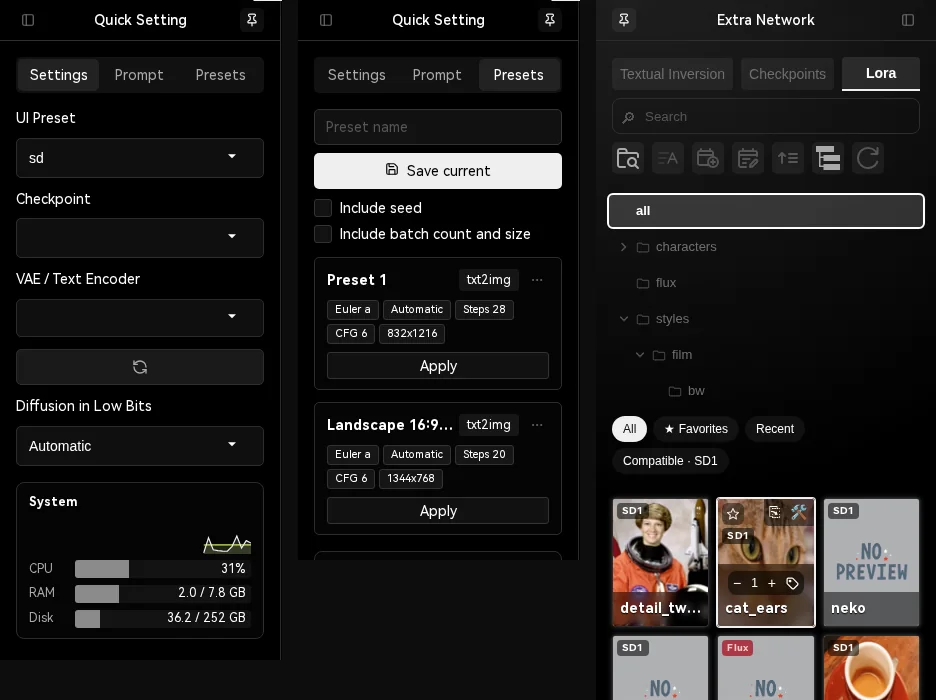

The right sidebar (on the right in the image above) keeps LoRAs, embeddings and checkpoints one glance away:

- **Model types as a side rail**: Embedding, Checkpoint, LoRA... in a column down the side of the sidebar, with an icon each, instead of tabs wrapping over two or three lines. The cards get the full height.
- **Folder tree**: one folder per line, sub-folders open on click, the active folder highlighted. Works with Windows paths and with reForge's own tree view.
- **LoRA cards**: a ☆ for favourites; a badge with the model family the LoRA was trained for, red when it does not match the loaded model; a weight control on hover (<kbd>−</kbd> / <kbd>+</kbd> or the mouse wheel), remembered per LoRA; a button that adds its trigger words.
- **Filter bar**: All, Favorites, Recent, and Compatible with the loaded model.

### Quick Setting sidebar

The left sidebar has three tabs: **Settings** (the WebUI's quick settings), **Prompt** (the prompt editor) and **Presets**. Under them, a **System** card in the spirit of ComfyUI's Crystools: CPU, RAM, GPU load, VRAM, GPU temperature and power, and disk, with a short history line. GPU readings use NVIDIA's NVML, installed on the next start.

### Progress you can watch

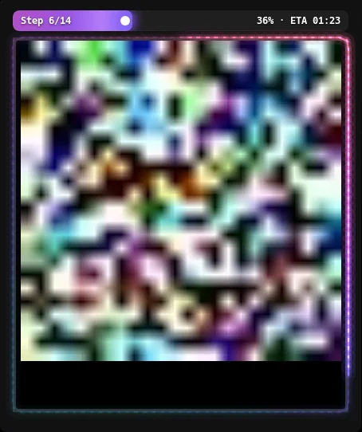

- **Aurora progress bar**: a flowing gradient with a glowing head, labelled with the step, the batch position, the percent and the ETA. Or **Classic**.
- **Result frame**, around the image while it generates: **Glow edge** lights up as progress grows, **Pulse** sends a ring out on every step, **Ambient** glows in the live preview's colours, **Scan** sweeps a line down the image, **Orbit** sends glowing motes round the border. Or **Off**.
- The browser tab shows a progress ring, and a ✓ when a generation finishes while you are elsewhere. A desktop notification can be turned on.

Everything follows your primary colour and holds still when the system asks for reduced motion.

<br clear="right"/>

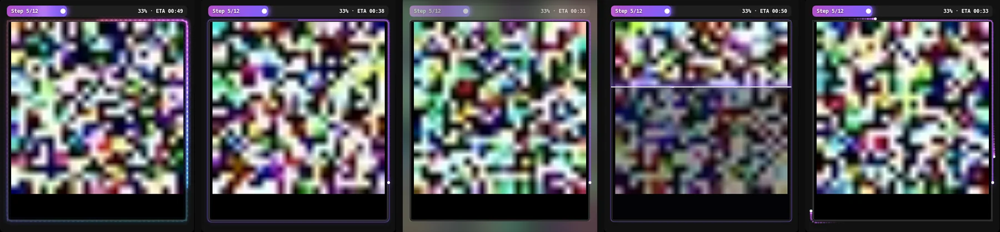

<p align="center"><sub>Glow edge · Pulse · Ambient · Scan · Orbit</sub></p>

### Appearance: make it yours

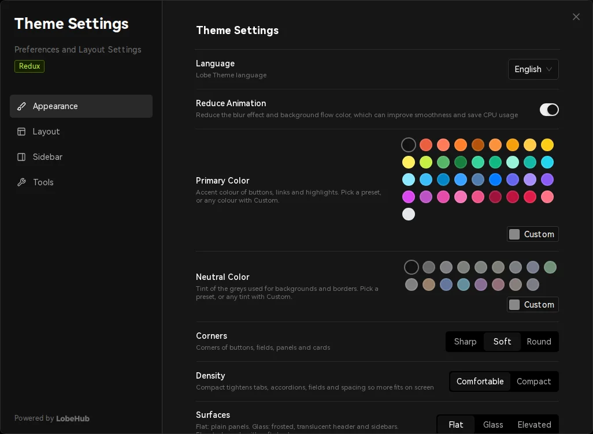

**Theme Settings → Appearance**:

- **Primary** and **neutral** colours: presets or any colour.
- **Corners**: Sharp, Soft or Round.
- **Density**: Comfortable or Compact.
- **Surfaces**: Flat, Glass (frosted header and sidebars) or Elevated (cards with soft shadows).
- **Fonts**: HarmonyOS Sans, Inter, Geist, Manrope, Be Vietnam Pro; Hack, Geist Mono or JetBrains Mono for code and prompts. All ship with the theme, so they work offline.
- **Logo**: LobeHub, Kitchen, a spark mark, a wordmark, your own image or emoji, or none.
- **Progress bar** and **Result frame**, above.

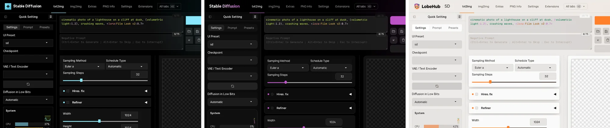

**Theme Settings → Layout** swaps the sidebars and can fold accordions **one at a time**, so a long column of extensions stays short. Folding never switches an extension off.

### Command palette

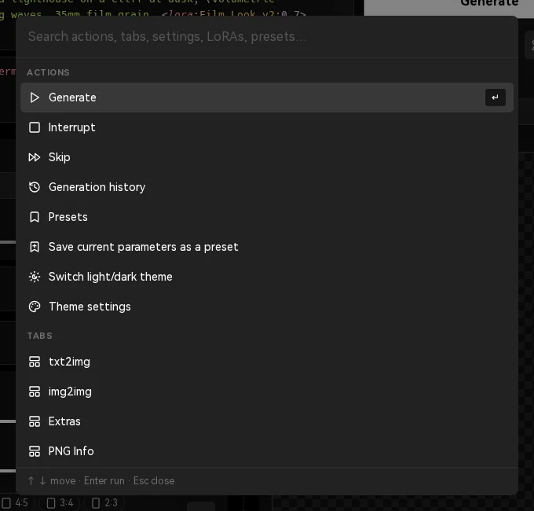

Press <kbd>Ctrl</kbd> + <kbd>K</kbd> (<kbd>⌘</kbd> + <kbd>K</kbd> on macOS) and type:

- Generate, Interrupt, Skip, theme, history, presets;
- any tab;
- samplers, schedule types, checkpoints;
- LoRAs (added with their saved weight), presets, recent generations;
- any WebUI setting: the Settings tab opens right on it.

<kbd>↑</kbd> <kbd>↓</kbd> to move, <kbd>Enter</kbd> to run, <kbd>Esc</kbd> to close.

<br clear="right"/>

### Generation history

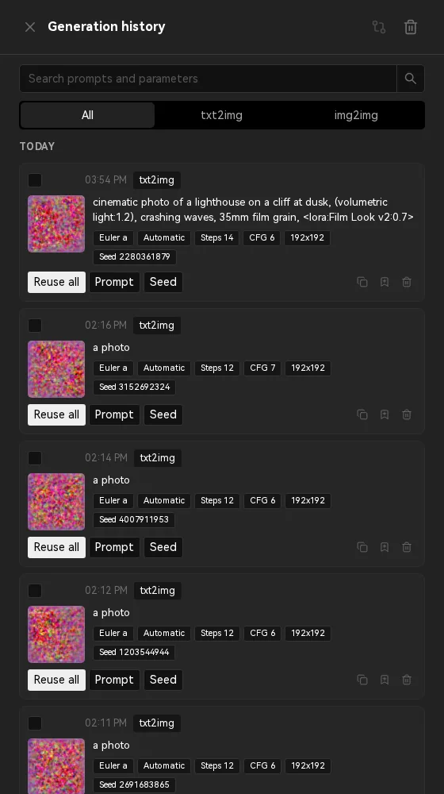

Every txt2img and img2img generation, kept with its parameters and a thumbnail. Open it from the clock in the header.

- Search prompts and parameters, filter by tab, grouped by day.
- **Reuse all**, or only the **Prompt** or the **Seed**.
- Copy the parameters, save them as a preset, open the full images.
- Tick two entries to compare them, prompt tokens included.

History is kept on the WebUI server (`lobe_data/history/`), so it is the same in every browser. It keeps the newest 2,000 entries and never touches your outputs folder.

<br clear="right"/>

### Presets

The **Presets** tab in the left sidebar (in the sidebars image above) saves the parameters you have set: sampler, schedule type, steps, CFG (and Distilled CFG on Flux), size and hires fix, optionally the seed and batch settings, never the prompts. **Apply** puts them back and leaves your prompt alone. Presets can be renamed, reordered, and saved straight from a history entry.

### And the small things

- **Image buttons under Generate**: open folder, save, zip, send to img2img and the rest sit right below **Generate** instead of under the gallery.
- **Split previewer**, **prompt syntax highlighting**, **prompt editor** and **image info** are regular options now, no longer experimental.
- **Works offline**: logo, favicons and fonts ship with the extension.
- Chips and buttons keep readable text on any primary colour.
- The UI no longer shows raw translation keys on first load.

<div align="right">

[![][back-to-top]](#readme-top)

</div>

---

<div align="center">

**The original Lobe Theme**

Everything below is the original Lobe Theme README, kept and updated for Redux.

</div>


![][cover]

<details>
<summary><kbd>Table of contents</kbd></summary>

#### TOC

- [🔥 What's New in Redux](#-whats-new-in-redux)
- [👋🏻 Getting Started & Join Our Community](#-getting-started--join-our-community)
- [📦 Extension Installation](#-extension-installation)
- [✨ Feature Overview](#-feature-overview)
- [🖥 Environment Support](#-environment-support)
- [📦 Ecosystem](#-ecosystem)
- [⌨️ Local Development](#️-local-development)
- [🤝 Contributing](#-contributing)
- [🩷 Sponsor](#-sponsor)
- [🔗 Links](#-links)
  - [More Products](#more-products)
  - [Credits](#credits)

####

</details>

## 👋🏻 Getting Started & Join Our Community

Please be aware that LobeTheme is currently under active development, and feedback is welcome for any [issues][github-issues-link] encountered.

| [![][discord-shield-badge]][discord-link] | Join our Discord community! This is where you can connect with developers and other enthusiastic users of LobeHub. |
| :---------------------------------------- | :----------------------------------------------------------------------------------------------------------------- |

> \[!IMPORTANT]
>
> **Star Us**, You will receive all release notifications from GitHub without any delay \~ ⭐️

<details><summary><kbd>Star History</kbd></summary>
  <picture>
    <source media="(prefers-color-scheme: dark)" srcset="https://api.star-history.com/svg?repos=lobehub%2Fsd-webui-lobe-theme&theme=dark&type=Date">
    
  </picture>
</details>

<div align="right">

[![][back-to-top]](#readme-top)

</div>

## 📦 Extension Installation

> \[!NOTE]
>
> Redux is made for Stable Diffusion WebUI Forge, Forge Classic (Neo) and reForge.

#### `A` Installation via SD WebUI Extension Market

In Stable Diffusion WebUI, you can install the Lobe Theme extension through the built-in extension market.

- First, open Stable Diffusion WebUI and go to the extension market. Enter "Lobe Theme" in the search box and click the search button. You will see a list of related extensions.
- After finding the Lobe Theme extension, click the install button. The system will start downloading and installing the extension. After installation, you can find the Lobe Theme in the extension list, and it will take effect after reloading the UI.

#### `B` Clone this Repository via Git (Recommended)

If you prefer to manage extensions using Git, you can clone the repository to your extensions folder. Here are the detailed steps:

- Open the command line interface and navigate to the root directory of Stable Diffusion WebUI.
- Run the following command in the command line to clone the repository:

```shell
git clone "https://github.com/sca-285/sd-webui-lobe-theme-redux.git"
```

> Once you have completed these steps, the Lobe Theme extension will be successfully installed in Stable Diffusion WebUI.

<div align="right">

[![][back-to-top]](#readme-top)

</div>

## ✨ Feature Overview

![][feat-thememode]

#### `1` Light & Dark Theme

The current theme design provides two visual effects: light theme and dark theme,
to meet the visual comfort needs of users in different lighting environments,
which can be quickly switched in the upper right corner of the navigation bar.

If you prefer to default to the dark theme, you can achieve this by using the startup parameter `--theme=dark`.

> \[!TIP]
>
> To force a certain color theme in the startup file, for example, if you want to default to the dark mode in the Windows system, you can add the following content to the `webui-user.bat` file:

```shell
set COMMANDLINE_ARGS= --theme=dark
```

In addition, you can also directly switch the theme through URL parameters:

```shell
http://localhost:7860/?__theme=light
http://localhost:7860/?__theme=dark
```

Through these simple and intuitive operations,
users can quickly switch the interface theme according to their personal preferences or current environment,
in order to achieve the best user experience.

<div align="right">

[![][back-to-top]](#readme-top)

</div>

![][feat-theme-modify]

#### `2` Personalized Theme Customization

As a design engineer, LobeChat considers the personalized experience of users in interface design,
and has introduced a flexible and changeable theme mode, providing a series of color customization options,
allowing users to adjust the theme color of the application according to their preferences.

Whether you want a stable deep blue, a lively peach pink, or a professional gray and white,
users can find color options that match their style in LobeTheme.

> \[!TIP]
>
> By clicking the gear icon in the upper right corner of the page, you can enter the settings panel for personalized customization.
>
> - **Primary Color**: We provide `13` carefully selected theme color schemes to meet your personalized color needs.
> - **Neutral Color**: For a more detailed adjustment of the visual experience, you can also choose from `6` different neutral gray levels.
> - **Logo Type**: You can choose the default `Lobe` and `Kitchen` logos, or customize them.
> - **Logo Customization**: Support inputting `img url`, `base64` encoded images, or `emoji` emoticons for logo customization. When entering a single `emoji`, the system will automatically convert it into a 3D Fluent Emoji, enriching the visual effect.
> - **Site Title Customization**: Allows you to customize the title of the website according to your needs.

<div align="right">

[![][back-to-top]](#readme-top)

</div>

![][feat-highlight]

#### `3` Prompt Syntax Highlighting

When using the Stable Diffusion model for Prompt writing,
an effective feature is the Prompt syntax highlighting.

This feature automatically adds color coding to the input Prompt text according to preset syntax rules,
enhancing the user experience and the intuitiveness of operations.
Prompt syntax highlighting can not only help users identify and construct syntax structures more clearly,
but also improve the efficiency of text editing and debugging.

<div align="right">

[![][back-to-top]](#readme-top)

</div>

![][feat-sidebar]

#### `4` Customizable Sidebar

One of the key highlights of LobeTheme is its highly customizable sidebar feature,
designed to make the image generation workflow smoother,
ensuring that every user can adjust and optimize their workspace according to their preferences.

> \[!TIP]
>
> By clicking the gear icon in the upper right corner of the interface, you can easily access and adjust the following settings:
>
> - **Input Area**
>   - Display Mode: `Scroll Fixed Height` | `Adjust Size According to Text Lines`
> - **Sidebar Configuration**
>   - Default Expansion: `true`
>   - Display Mode: `Fixed` | `Floating`
>   - Default Width: `280 pixels`
> - **Extra Network Sidebar**
>   - Enable: `true`
>   - Default Expansion: `true`
>   - Display Mode: `Fixed` | `Floating`
>   - Default Width: `340 pixels`
>   - Model Card Default Size: `86 pixels`

<details>
<summary><kbd>Recommended System Settings</kbd></summary>

**Extra-Networks Extension Model Window**

- Thumbnail View
- Card Width: 86
- Card Height: 128

**Quick-Setting**

```txt
sd_model_checkpoint, sd_vae, CLIP_stop_at_last_layers, img2img_background_color, img2img_color_correction, samples_save, samples_format, grid_save, return_grid,  n_rows, live_previews_enable, show_progress_every_n_steps, live_preview_refresh_period
```

</details>

<div align="right">

[![][back-to-top]](#readme-top)

</div>

![][feat-generation-info]

#### `5` Improved Image Information Display

The display of generation information has been improved,
with a deep optimization of the data presentation mechanism,
and the introduction of a "one-click copy" function to improve information retrieval efficiency.

Now, you can quickly obtain the required Seeds without tedious searching in long strings.

<div align="right">

[![][back-to-top]](#readme-top)

</div>

![][feat-share]

#### `6` Image Recipe Sharing

A brand-new image sharing feature has been launched.
With a simple one-click operation, you can easily share the current image recipe,
create exquisite shared images, and explore more customizable settings to make the shared images more personalized.

<div align="right">

[![][back-to-top]](#readme-top)

</div>

![][feat-prompt-editor]

#### `7` Prompt Editor

A user-friendly prompt word editor has been added to the second tab of the quick setting menu.
It includes a series of preset tags covering post-processing, style description, and other key words,
simplifying your operation process and helping you edit and manage prompts more efficiently.

<div align="right">

[![][back-to-top]](#readme-top)

</div>

![][feat-mobile-friendly]

#### `8` Mobile-Friendly Adaptation

In order to improve the interactive experience of mobile users,
LobeTheme has implemented an intelligent folding mechanism for breadcrumb navigation and finely adapted the sidebar.
These adjustments are aimed at providing convenient and intuitive navigation experience on any device.

However, achieving the same complex functions and detailed customization as the desktop on the mobile end poses certain challenges.
Especially when integrating with the Stable Diffusion WebUI interface, high complexity and precise parameter settings are required,
which may result in differences in user experience between mobile and desktop.

If you have any suggestions or ideas, please feel free to provide feedback through GitHub Issues or Pull Requests.

<div align="right">

[![][back-to-top]](#readme-top)

</div>

![][feat-pwa]

#### `9` PWA Progressive Web Application

In today's multi-device environment, providing a seamless experience for users is crucial.
Therefore, we have adopted the Progressive Web Application [PWA](https://support.google.com/chrome/answer/9658361) technology,
which is a modern web technology that can elevate web applications to a near-native application experience.

Through PWA, LobeTheme can provide a highly optimized user experience on desktop and mobile devices,
while maintaining lightweight and high performance characteristics. Visually and perceptually,
it has been carefully designed to ensure that its interface is indistinguishable from native applications,
providing smooth animations, responsive layout, and adaptation to different screen resolutions of different devices.

> \[!NOTE]
>
> If you are not familiar with the installation process of PWA, you can follow these steps to add LobeChat as your desktop application (also applicable to mobile devices):
>
> - Run the Chrome or Edge browser on your computer.
> - Visit the LobeChat website.
> - Click the <kbd>Install</kbd> icon in the upper right corner of the address bar.
> - Follow the on-screen instructions to complete the installation of PWA.

<div align="right">

[![][back-to-top]](#readme-top)

</div>

#### `10` Prompt Word Formatting

Click the <kbd>🪄</kbd> button below the Prompt to format the prompt words with one click.

> \[!TIP]
>
> Convert full-width punctuation to half-width, remove extra spaces, add missing commas, and move the Extra-Networks model to the end.

Before formatting

```text
photorealistic   photo of a handsome male (wizard  :1.2）， <lora:LuisapHotlineStyle:0.5> <lora:ElegantHanfuRuqunStyle:0.2>    short beard, white wizard  shirt, (with golden    trim:0.8),
```

After formatting

```text
photorealistic photo of a handsome male, (wizard:1.2), short beard, white wizard shirt, (with golden trim:0.8), <lora:LuisapHotlineStyle:0.5>, <lora:ElegantHanfuRuqunStyle:0.2>
```

<div align="right">

[![][back-to-top]](#readme-top)

</div>

#### `11` Tab Bar

The header shows the tabs you use; every tab is one click away in **All tabs**, grouped into Generate, Tools, Extensions and System, with a search box. The pin next to a tab puts it in the bar or takes it out; the tab you have open always shows. The bar starts with txt2img, img2img, Extras, PNG Info, Settings and Extensions, and is kept on the WebUI server, so every browser shows the same one. **Reset bar** goes back to that.

<div align="right">

[![][back-to-top]](#readme-top)

</div>

#### `12` Command Palette

Press <kbd>Ctrl</kbd> + <kbd>K</kbd> (<kbd>⌘</kbd> + <kbd>K</kbd> on macOS), or the ⌘ button in the header, and type. One search box reaches:

- actions: Generate, Interrupt, Skip, light/dark theme, theme settings, history, presets, save the current parameters as a preset;
- every top-level tab;
- samplers, schedule types and checkpoints (picked in the WebUI's own dropdowns);
- LoRAs (added to the prompt with their saved weight), presets, recent generations;
- every WebUI setting: the Settings tab opens, filtered to it, and the setting is highlighted.

Use <kbd>↑</kbd> <kbd>↓</kbd> to move, <kbd>Enter</kbd> to run, <kbd>Esc</kbd> to close.

<div align="right">

[![][back-to-top]](#readme-top)

</div>

#### `13` Generation History

Every finished txt2img and img2img generation is kept with its full parameters and small thumbnails. Open it from the clock button in the header.

- search prompts and parameters, filter by tab, grouped by day;
- **Reuse all** applies every parameter through the WebUI's own "read generation parameters" logic; **Prompt** and **Seed** reuse only those;
- copy the parameters, save them as a preset, open the full images;
- tick two entries and press compare to see what changed, prompt tokens included.

History is stored on the WebUI server in `lobe_data/history/` inside the extension folder, so it is the same in every browser and survives clearing browser data. It keeps the newest 2,000 entries; clearing it does not touch the images in your outputs folder.

> \[!NOTE]
>
> The theme's routes (`/lobe/...`) have no login of their own, like the WebUI's `/file=` route. When the WebUI is started with `--listen` or `--share`, anyone who can open it can also read this history. Turn it off under **Theme Settings → Tools** if that matters.

<div align="right">

[![][back-to-top]](#readme-top)

</div>

#### `14` Parameter Presets

A **Presets** tab in the left sidebar. **Save current** stores the sampler, schedule type, steps, CFG (and Distilled CFG on Flux), size, and hires fix settings, optionally the seed and batch count and size, without the prompts. **Apply** sets them through the WebUI's own parameter reader and leaves the prompts as they are. Presets can be renamed, overwritten, reordered, and saved straight from a history entry.

<div align="right">

[![][back-to-top]](#readme-top)

</div>

#### `15` LoRA Card Tools

On the LoRA cards of the Extra Networks sidebar:

- a ☆ to mark favourites;
- a badge with the model family the LoRA was trained for, red when it does not match the loaded model. The families follow Forge Classic (Neo)'s UI presets: SD1, XL, Flux, Klein (Flux.2), Qwen, Lumina, Z-Image, Wan, Anima, Ernie, PiD and Krea, plus SD2 and SD3 on the WebUIs that load them. The family is taken, in this order, from the **Preset** set in the card's metadata editor, from the trainer's metadata in the file, and from the LoRA's layer names and sizes;
- on hover, a weight control: <kbd>−</kbd> / <kbd>+</kbd> or the mouse wheel. The weight is remembered per LoRA, used when the card is clicked, and updates the LoRA's tag if it is already in the prompt. Click the number to go back to the default;
- a tag button that adds the LoRA's trigger words (from its "Activation text", a Civitai `.civitai.info` file, or its most frequent training tags);
- a filter bar: **All**, **Favorites**, **Recent**, **Compatible** with the loaded model. On Forge and Neo, **Compatible** follows the **UI Preset** as it changes.

<div align="right">

[![][back-to-top]](#readme-top)

</div>

#### `16` Progress on the Browser Tab

While a generation runs, the tab icon shows a progress ring. When it finishes while you are in another tab or window, the icon gets a check mark and the title starts with ✓ until you come back. **Desktop notification** (off by default, under **Theme Settings → Tools**) also shows a system notification with the prompt and a thumbnail.

<div align="right">

[![][back-to-top]](#readme-top)

</div>

#### `17` Works Offline

The logo, favicons and web fonts ship with the extension (`assets/`) and are served by the WebUI itself, so the theme looks the same without internet access. Chinese and Japanese UIs still load the large CJK web font from the CDN when it is reachable, and fall back to system fonts otherwise.

<div align="right">

[![][back-to-top]](#readme-top)

</div>

#### `18` Image Buttons Under Generate

The row of image buttons (open folder, save, zip, send to img2img, inpaint and extras, and those extensions add) sits right under **Generate / Interrupt / Skip** instead of under the gallery, in txt2img and img2img, with or without the split previewer. **Theme Settings → Layout → Image buttons under Generate** puts it back.

<div align="right">

[![][back-to-top]](#readme-top)

</div>

#### `19` Aspect Ratios and Suggested Settings

Under **Width** and **Height**, in txt2img and img2img:

- **Ratio**: 1:1, 4:5, 3:4, 2:3, 9:16, 9:21, 5:4, 4:3, 3:2, 16:9, 21:9. A click sets a width and height of that shape with about the pixels of the **Base** size, on the sliders' own step; the tooltip shows the size first. At 1024 these are the sizes SDXL-class models were trained on (1344 × 768 for 16:9, 832 × 1216 for 2:3...). The shape that matches the sliders is highlighted.
- 🔒 keeps the current shape: moving one slider moves the other.
- **Base**: how many pixels the image has, about base × base. **Auto** follows the loaded model (512 for SD1, 768 for SD2, 1024 for the rest), or pick 512, 768, 1024 or 1536. Choosing a base resizes the image at once and keeps its shape.
- **Suggested**: steps and CFG scale for the loaded model's family (SD1, SD2, XL, SD3, Flux, Krea, Qwen, Lumina, Z-Image), and for the fast variants named in the checkpoint (Lightning, Turbo, LCM, Hyper, DMD2, Schnell). On Forge and Neo, the Flux suggestions also set **Distilled CFG Scale**. The family follows Forge's **UI Preset** and the checkpoint as they change.

**Theme Settings → Tools → Aspect ratios and suggested settings** turns them off.

<div align="right">

[![][back-to-top]](#readme-top)

</div>

#### `20` Look and Feel

**Theme Settings → Appearance**:

- **Corners**: Sharp, Soft (the default) or Round, for buttons, fields, panels and cards.
- **Density**: Comfortable or Compact. Compact tightens tabs, accordions, fields and spacing so more fits on screen.
- **Surfaces**: Flat, Glass (frosted, translucent header and sidebars) or Elevated (cards with soft shadows).
- **Font** and **Monospace font**: HarmonyOS Sans, Inter, Geist, Manrope, Be Vietnam Pro or the system font; Hack, Geist Mono, JetBrains Mono or the system mono font. All ship with the theme (SIL Open Font License), so they work offline.
- **Logo**: LobeHub, Kitchen, a spark mark or a wordmark in the primary colour, your own image or emoji, or none.

<div align="right">

[![][back-to-top]](#readme-top)

</div>

#### `21` Layout Options

**Theme Settings → Layout**:

- **Swap sidebars**: Quick Setting on the right, Extra Network on the left.
- **Accordions → One at a time**: opening an accordion folds the others next to it, so a long column of extensions stays short. Folding never switches an extension off: accordions with a ticked checkbox are only folded by the theme, and a click on the title unfolds them.
- **Split Previewer**, **Prompt Syntax Highlighting**, **Prompt Editor** and **Image Info** (under Tools) are regular options now; they used to be experimental.

<div align="right">

[![][back-to-top]](#readme-top)

</div>

#### `22` System Monitor

Under the quick settings: CPU, RAM, GPU load, VRAM, GPU temperature and power, and disk, with a short history line, in the spirit of ComfyUI's Crystools. GPU load and temperature come from NVIDIA's NVML: the theme installs `nvidia-ml-py` on the next start (a small pure-Python package); without it, VRAM still shows. **Theme Settings → Sidebar → System monitor** turns it off.

<div align="right">

[![][back-to-top]](#readme-top)

</div>

#### `23` Extra Network Folder Tree

Folders of LoRAs, embeddings and checkpoints show as a tree: one folder per line, indented by depth, only the top level at first; a folder with sub-folders has a caret and opens when clicked. The folder the cards are filtered to is highlighted. The buttons keep doing what the WebUI does with them (search that folder), with the folder text exactly as the WebUI wrote it, so Windows paths and the "Add a '/' to the Dir buttons" option work. On WebUIs that use the A1111 1.8+ tree view (reForge by default), that tree goes above the cards in the sidebar. **Theme Settings → Sidebar → Folder tree** turns it off.

<div align="right">

[![][back-to-top]](#readme-top)

</div>

#### `24` Progress Effects

Two independent options under **Theme Settings → Appearance**:

- **Progress bar**: *Aurora* (default) is a taller bar with a flowing gradient, a moving sheen and a glowing head, labelled with the step, the batch position, the percent and the ETA ("Step 7/20 · 2/4" … "35% · ETA 00:12"). *Classic* keeps the WebUI's bar.
- **Result frame**: an animated edge around the result box while an image is generated. *Glow edge* (default) is a slowly turning multi-coloured edge that lights up as progress grows; *Pulse* sends a ring outward on every sampling step; *Ambient* takes its colours from the live preview; *Scan* sweeps a line down the image; *Orbit* sends glowing motes round the border, one more for every eighth of the job. *Off* turns it off.

Both follow the primary colour (a violet when the primary colour is a grey). The step count comes from the theme's `/lobe/state` route; without it, the label shows the percent and ETA only. With the system's "reduce motion" setting on, the effects stay still.

<div align="right">

[![][back-to-top]](#readme-top)

</div>

#### `25` Prompt Sections

The ▤ button among the tools under the prompt (txt2img and img2img) turns the positive prompt into sections: one box per `BREAK` chunk, at least two, up to six. The WebUI's own prompt box stays the real prompt: every change in a section writes all sections back into it, joined with `BREAK` on its own line, so generation, the infotext, PNG Info, styles and other extensions see the usual prompt. Changes made from outside (paste, Send to txt2img, PNG Info, styles, other extensions) rebuild the sections from the prompt, split at each `BREAK`. Each section shows an estimate of its tokens, highlighted past 75; the WebUI's counter keeps the exact total. The switch is remembered per tab. It is not regional prompting. **Theme Settings → Tools → Prompt sections** removes the button.

<div align="right">

[![][back-to-top]](#readme-top)

</div>

#### `26` Extra Network Side Rail

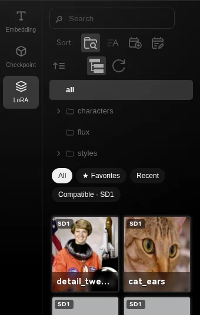

In the Extra Network sidebar, the model types (Textual Inversion, Hypernetworks, Checkpoints, Lora, and tabs added by extensions) become a narrow column on the side, an icon and a short name each, the full name on hover. The search and sort controls move above the cards, and the cards get the whole height of the sidebar. **Theme Settings → Sidebar → Model types as a side rail** brings the tabs back.

<br clear="right"/>

<div align="right">

[![][back-to-top]](#readme-top)

</div>

#### More Features

- [x] 💎 **Exquisite UI Design**: Carefully designed interface with elegant appearance and smooth interactive effects.
- [x] 🖼️ **Multiple Layout Modes**: In the dual-column mode, it achieves adjustable canvas proportions, ensuring that the generated images are always on top.
- [x] 🌍 **Internationalization Support**: Fully supports major i18n languages and welcomes contributions on [PR](https://github.com/lobehub/sd-webui-lobe-theme/tree/main/locales).

> ✨ With continuous updates in product iterations, we hope to bring more exciting features!

<div align="right">

[![][back-to-top]](#readme-top)

</div>

## 🖥 Environment Support

| [](http://godban.github.io/browsers-support-badges/)<br>Chrome | [](http://godban.github.io/browsers-support-badges/)<br>Edge | [](http://godban.github.io/browsers-support-badges/)<br>Safari |
| ------------------------------------------------------------------------------------------------------------------------------------------------------------------------------------------------------------ | ---------------------------------------------------------------------------------------------------------------------------------------------------------------------------------------------------- | ------------------------------------------------------------------------------------------------------------------------------------------------------------------------------------------------------------ |
| last 2 versions                                                                                                                                                                                              | last 2 versions                                                                                                                                                                                      | last 2 versions                                                                                                                                                                                              |

> \[!CAUTION]
>
> There is currently a known compatibility issue with styles on Firefox browser.

<div align="right">

[![][back-to-top]](#readme-top)

</div>

## 📦 Ecosystem

| NPM                             | Repository                            | Description                                                                                                             | Version                                 |
| ------------------------------- | ------------------------------------- | ----------------------------------------------------------------------------------------------------------------------- | --------------------------------------- |
| [@lobehub/ui][lobe-ui-link]     | [lobehub/lobe-ui][lobe-ui-github]     | Lobe UI is an open-source UI component library dedicated to building AIGC web applications.                             | [![][lobe-ui-shield]][lobe-ui-link]     |
| [@lobehub/lint][lobe-lint-link] | [lobehub/lobe-lint][lobe-lint-github] | LobeLint provides configurations for ESlint, Stylelint, Commitlint, Prettier, Remark, and Semantic Release for LobeHub. | [![][lobe-lint-shield]][lobe-lint-link] |
| @lobehub/assets                 | [lobehub/assets][lobe-assets-github]  | Logo assets, favicons, webfonts for LobeHub.                                                                            |                                         |

<div align="right">

[![][back-to-top]](#readme-top)

</div>

## ⌨️ Local Development

You can use Github Codespaces for online development:

[![][codespaces-shield]][codespaces-link]

Alternatively, you can clone it for local development. To enable hot-reloading mode, you need to start stable diffuison on port `7860` in advance.

[![][bun-shield]][bun-link]

```bash
$ git clone https://github.com/lobehub/sd-webui-lobe-theme.git
$ cd sd-webui-lobe-theme
$ bun install
$ bun dev
```

<div align="right">

[![][back-to-top]](#readme-top)

</div>

## 🤝 Contributing

Contributions of all types are more than welcome, if you are interested in contributing code, feel free to check out our GitHub [Issues][github-issues-link] to get stuck in to show us what you’re made of.

[![][pr-welcome-shield]][pr-welcome-link]

<a href="https://github.com/lobehub/sd-webui-lobe-theme/graphs/contributors" target="_blank">
  <table>
    <tr>
      <th colspan="2">
        <br><br><br>
      </th>
    </tr>
    <tr>
      <td>
        <picture>
          <source media="(prefers-color-scheme: dark)" srcset="https://next.ossinsight.io/widgets/official/compose-org-active-contributors/thumbnail.png?activity=active&period=past_90_days&owner_id=131470832&repo_ids=606329910&image_size=2x3&color_scheme=dark">
          
        </picture>
      </td>
      <td rowspan="2">
        <picture>
          <source media="(prefers-color-scheme: dark)" srcset="https://next.ossinsight.io/widgets/official/compose-org-participants-growth/thumbnail.png?activity=active&period=past_90_days&owner_id=131470832&repo_ids=606329910&image_size=4x7&color_scheme=dark">
          
        </picture>
      </td>
    </tr>
    <tr>
      <td>
        <picture>
          <source media="(prefers-color-scheme: dark)" srcset="https://next.ossinsight.io/widgets/official/compose-org-active-contributors/thumbnail.png?activity=new&period=past_90_days&owner_id=131470832&repo_ids=606329910&image_size=2x3&color_scheme=dark">
          
        </picture>
      </td>
    </tr>
  </table>
</a>

<div align="right">

[![][back-to-top]](#readme-top)

</div>

## 🩷 Sponsor

Every bit counts and your one-time donation sparkles in our galaxy of support! You're a shooting star, making a swift and bright impact on our journey. Thank you for believing in us – your generosity guides us toward our mission, one brilliant flash at a time.

<a href="https://opencollective.com/lobehub" target="_blank">
  <picture>
    <source media="(prefers-color-scheme: dark)" srcset="https://github.com/lobehub/.github/blob/main/static/sponsor-dark.png?raw=true">
    
  </picture>
</a>

<div align="right">

[![][back-to-top]](#readme-top)

</div>

## 🔗 Links

### More Products

- **[🤖 Lobe Chat][lobe-chat] :** An open-source, extensible (Function Calling), high-performance chatbot framework. It supports one-click free deployment of your private ChatGPT/LLM web application.
- **[🌏 Lobe i18n][lobe-i18n] :** Lobe i18n is an automation tool for the i18n (internationalization) translation process, powered by ChatGPT. It supports features such as automatic splitting of large files, incremental updates, and customization options for the OpenAI model, API proxy, and temperature.
- **[💌 Lobe Commit][lobe-commit] :** Lobe Commit is a CLI tool that leverages Langchain/ChatGPT to generate Gitmoji-based commit messages.

### Credits

- stable-diffusion-webui：<https://github.com/AUTOMATIC1111/stable-diffusion-webui>
- gradio-theme-gallery: <https://huggingface.co/spaces/gradio/theme-gallery>
- cozy-nest: <https://github.com/Nevysha/Cozy-Nest>
- Fonts bundled in `assets/fonts`: HarmonyOS Sans (Copyright 2021 Huawei Device Co., Ltd., HarmonyOS Sans Fonts License Agreement) and Hack (MIT / Bitstream Vera License); Inter, Geist, Geist Mono, Manrope, Be Vietnam Pro and JetBrains Mono (SIL Open Font License 1.1, via Fontsource; latin, latin-ext, vietnamese and cyrillic subsets). Each folder contains its license.
- System monitor: GPU readings through NVIDIA's [nvidia-ml-py](https://pypi.org/project/nvidia-ml-py/) (BSD); the idea follows [ComfyUI-Crystools](https://github.com/crystian/ComfyUI-Crystools).
- Thanks also to **Claude**, Anthropic's AI assistant, for help building this version.
- _before `1.0.0` version_
  - sd-web-ui-quickcs: <https://github.com/Gerschel/sd-web-ui-quickcss/>
  - Dark-Themes-SD-WebUI-Automatic1111: <https://github.com/Nacurutu/Dark-Themes-SD-WebUI-Automatic1111>

<div align="right">

[![][back-to-top]](#readme-top)

</div>

---

<details><summary><h4>📝 License</h4></summary>

[![][fossa-license-shield]][fossa-license-link]

</details>

Copyright © 2023 [LobeHub][profile-link]. <br />
This project is [AGPL3](./LICENSE) licensed.

<!-- LINK GROUP -->

[back-to-top]: https://img.shields.io/badge/-BACK_TO_TOP-151515?style=flat-square
[bun-link]: https://bun.sh
[bun-shield]: https://img.shields.io/badge/-speedup%20with%20bun-black?logo=bun&style=for-the-badge
[codespaces-link]: https://codespaces.new/lobehub/sd-webui-lobe-theme
[codespaces-shield]: https://github.com/codespaces/badge.svg
[cover]: https://gw.alipayobjects.com/zos/kitchen/8Ab%24hLJ5ur/cover.webp
[discord-link]: https://discord.gg/AYFPHvv2jT
[discord-shield]: https://img.shields.io/discord/1127171173982154893?color=5865F2&label=discord&labelColor=black&logo=discord&logoColor=white&style=flat-square
[discord-shield-badge]: https://img.shields.io/discord/1127171173982154893?color=5865F2&label=discord&labelColor=black&logo=discord&logoColor=white&style=for-the-badge
[feat-generation-info]: https://gw.alipayobjects.com/zos/kitchen/rIv%24%24AAE6A/feat_generation_info.webp
[feat-highlight]: https://gw.alipayobjects.com/zos/kitchen/iD%24W4U2y3Y/feat_highlight.webp
[feat-mobile-friendly]: https://gw.alipayobjects.com/zos/kitchen/WpWe6Hw8UT/feat_mobile_friendly.webp
[feat-prompt-editor]: https://gw.alipayobjects.com/zos/kitchen/FrA0mjmNv7/feat_prompt_editor.webp
[feat-pwa]: https://gw.alipayobjects.com/zos/kitchen/az49akOKJT/feat_pwa.webp
[feat-share]: https://gw.alipayobjects.com/zos/kitchen/h4QrGbJ9dF/feat_share.webp
[feat-sidebar]: https://gw.alipayobjects.com/zos/kitchen/Olum2IjxCW/feat_sidebar.webp
[feat-theme-modify]: https://gw.alipayobjects.com/zos/kitchen/CbhlynwJYg/feat_theme_modify.webp
[feat-thememode]: https://gw.alipayobjects.com/zos/kitchen/nSFtJidWUR/feat_thememode.webp
[fossa-license-link]: https://app.fossa.com/projects/git%2Bgithub.com%2Flobehub%2Fsd-webui-lobe-theme
[fossa-license-shield]: https://app.fossa.com/api/projects/git%2Bgithub.com%2Flobehub%2Fsd-webui-lobe-theme.svg?type=large
[github-action-release-link]: https://github.com/actions/workflows/lobehub/sd-webui-lobe-theme/release.yml
[github-action-release-shield]: https://img.shields.io/github/actions/workflow/status/lobehub/sd-webui-lobe-theme/release.yml?label=release&labelColor=black&logo=githubactions&logoColor=white&style=flat-square
[github-action-test-link]: https://github.com/actions/workflows/lobehub/sd-webui-lobe-theme/test.yml
[github-action-test-shield]: https://img.shields.io/github/actions/workflow/status/lobehub/sd-webui-lobe-theme/test.yml?label=test&labelColor=black&logo=githubactions&logoColor=white&style=flat-square
[github-contributors-link]: https://github.com/lobehub/sd-webui-lobe-theme/graphs/contributors
[github-contributors-shield]: https://img.shields.io/github/contributors/lobehub/sd-webui-lobe-theme?color=c4f042&labelColor=black&style=flat-square
[github-forks-link]: https://github.com/lobehub/sd-webui-lobe-theme/network/members
[github-forks-shield]: https://img.shields.io/github/forks/lobehub/sd-webui-lobe-theme?color=8ae8ff&labelColor=black&style=flat-square
[github-issues-link]: https://github.com/lobehub/sd-webui-lobe-theme/issues
[github-issues-shield]: https://img.shields.io/github/issues/lobehub/sd-webui-lobe-theme?color=ff80eb&labelColor=black&style=flat-square
[github-license-link]: https://github.com/lobehub/sd-webui-lobe-theme/blob/main/LICENSE
[github-license-shield]: https://img.shields.io/github/license/lobehub/sd-webui-lobe-theme?color=white&labelColor=black&style=flat-square
[github-release-link]: https://github.com/lobehub/sd-webui-lobe-theme/releases
[github-release-shield]: https://img.shields.io/github/v/release/lobehub/sd-webui-lobe-theme?color=369eff&labelColor=black&logo=github&style=flat-square
[github-releasedate-link]: https://github.com/lobehub/sd-webui-lobe-theme/releases
[github-releasedate-shield]: https://img.shields.io/github/release-date/lobehub/sd-webui-lobe-theme?labelColor=black&style=flat-square
[github-stars-link]: https://github.com/lobehub/sd-webui-lobe-theme/network/stargazers
[github-stars-shield]: https://img.shields.io/github/stars/lobehub/sd-webui-lobe-theme?color=ffcb47&labelColor=black&style=flat-square
[lobe-assets-github]: https://github.com/lobehub/lobe-assets
[lobe-chat]: https://github.com/lobehub/lobe-chat
[lobe-commit]: https://github.com/lobehub/lobe-commit/tree/master/packages/lobe-commit
[lobe-i18n]: https://github.com/lobehub/lobe-commit/tree/master/packages/lobe-i18n
[lobe-lint-github]: https://github.com/lobehub/lobe-lint
[lobe-lint-link]: https://www.npmjs.com/package/@lobehub/lint
[lobe-lint-shield]: https://img.shields.io/npm/v/@lobehub/lint?color=369eff&labelColor=black&logo=npm&logoColor=white&style=flat-square
[lobe-ui-github]: https://github.com/lobehub/lobe-ui
[lobe-ui-link]: https://www.npmjs.com/package/@lobehub/ui
[lobe-ui-shield]: https://img.shields.io/npm/v/@lobehub/ui?color=369eff&labelColor=black&logo=npm&logoColor=white&style=flat-square
[pr-welcome-link]: https://github.com/lobehub/lobe-chat/pulls
[pr-welcome-shield]: https://img.shields.io/badge/🤯_pr_welcome-%E2%86%92-ffcb47?labelColor=black&style=for-the-badge
[profile-link]: https://github.com/lobehub
[sponsor-link]: https://opencollective.com/lobehub 'Become 🩷 LobeHub Sponsor'
[sponsor-shield]: https://img.shields.io/badge/-Sponsor%20LobeHub-f04f88?logo=opencollective&logoColor=white&style=flat-square
